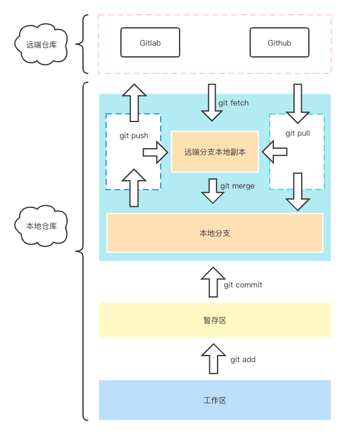
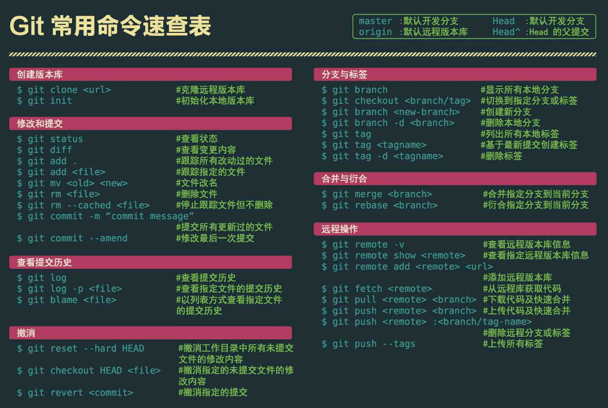

  
## Git 简介
<b>分布式版本管理工具</b>

Git(读音为/gɪt/。)是一个开源的分布式版本控制系统，可以有效、高速地处理从很小到非常大的项目版本管理。

Git 是为了帮助管理 Linux 内核开发而开发的一个开放源码的版本控制软件。

分布式相比于集中式的最大区别在于开发者可以提交到本地，每个开发者通过克隆（git clone）， 在本地机器上拷贝一个完整的Git仓库。

<b>GitLab和GitHub</b>

GitLab和GitHub是基于Git开发的第三方产品，一般大家常用到的也是这两个。

Github是全球最大的代码开源社区，同时提供公共仓库和私有仓库，免费注册即可托管开源代码或者创建公有仓库；创建私有仓库，则需要付费。
[官方网站](https://github.com/)

GitLab同GitHub一样，可以免费注册并且创建共有仓库和私有仓库，区别是GitLab创建私有仓库也是免费的。

### Git体系

### Git基本命令
1、创建版本仓库

    git init
2、版本创建

&emsp;2.1 提交到暂存区
  
      git add 文件或目录
&emsp;2.2 提交暂存区版本记录

      git commit -m'版本说明'
3、查看

&emsp;3.1查看版本记录
      
      git log
&emsp;3.2 查看状态
   
      git status
4、版本回退

    git reset --hard 版本序列号//或 git reset --hard HEAD^
5、查看操作记录

    git reflog
6、撤销修改

&emsp;6.1 直接丢弃工作区的改动

      git checkout --文件
&emsp;6.2 修改已加到暂存区，但未commit

&emsp;&emsp;（1） `git reset HEAD 文件`

&emsp;&emsp;（2）   `git checkout --文件`   

&emsp;6.3 已经commit的 进行`版本回退`

7、对比文件的不同

&emsp;7.1 对比工作区和版本库某个文件

      git diff HEAD --文件

&emsp;7.2 对比两个版本的文件

       git diff HEAD HEAD^ --文件

### Git 分支管理
1、查看分支

    git branch
2、创建分支

    git branch 分支名
3、切换分支

    git checkout 分支名
4、创建并切换分支

    git checkout -b 分支名
5、删除分支

    git branch -d 分支名
6、合并分支
 
    git merge 分支名
7、禁止快速合并

    git merge --on-ff  -m'说明'
8、冻结当前编辑分支
   
    git stash
9、列出冻结的分支
  
    git stash list
10、恢复分支

    git stash pop 

### Git 公钥使用
1、检查所有公钥

    ls -al ~/.ssh
2、生成公钥

    ssh-keygen -t rsa -C "邮箱地址"
3、切换目录

    cd ~/.ssh
4、查看公钥

    ls ~/.ssh
5、查看公钥序码

    cat id_rsa.pub
### GitHub 使用
GitHub公钥使用

1、在[官方网站](https://github.com/) 注册

2、创建仓库

3、配置公钥

4、克隆项目

    git clone 地址//github仓库上的ssh地址
5、推送代码

    git push origin 分支名称
6、跟踪远程

&emsp;本地跟踪远程分支

    git branch --set-upstream-to=origin/仓库分支名称 本地分支名称

&emsp;查看

    git status
7、从仓库分支拉取代码

    git pull origin 仓库分支名称
### Git 速查

